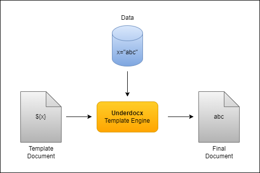
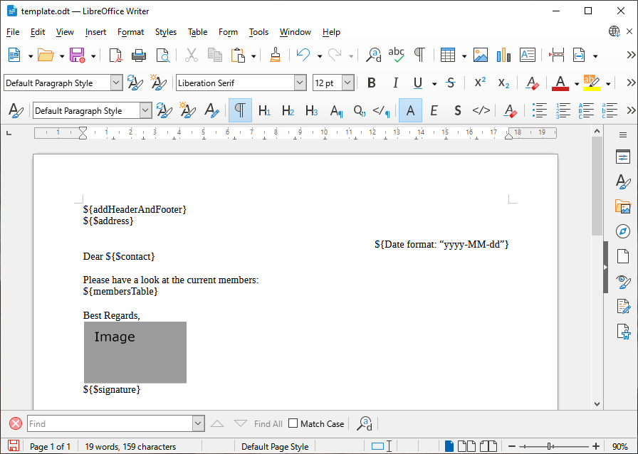
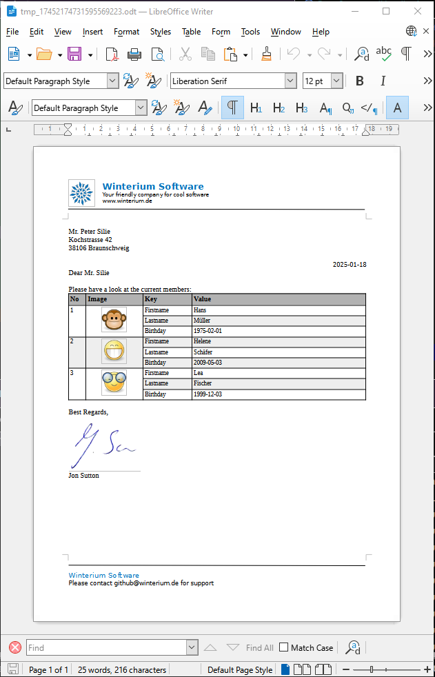
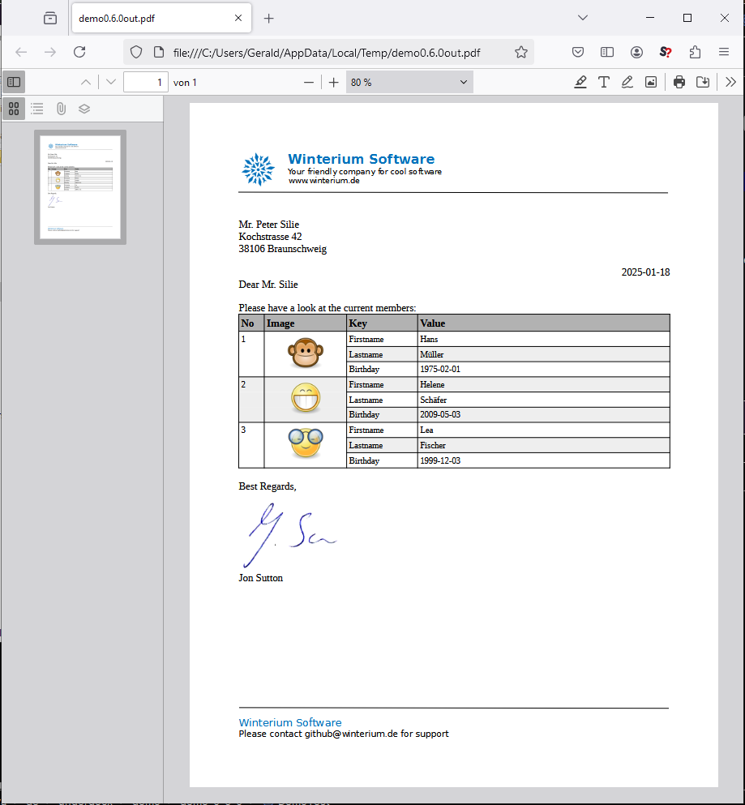

# Welcome to ${underdocx}

Underdocx is an extendable open source Java framework to manipulate 
multiple types of Documents, for example ODT text documents (LibreOffice/OpenOffice Writer), 
ODG Graphics (LibreOffice/OpenOffice Draw), ODP Presentations (LibreOffice/OpenOffice Impress), 
ODS Speadsheets (LibreOffic/OpenOffice Calc) and all plain text files as TXT, HTML, Scripts etc.
It is a template engine and 
uses different types of placeholders that can be
found and replaced by custom texts, images, tables and other documents.
Also documents can be converted to PDF if LibreOffice has been installed.



## underdocx.org
Please visit [underdocx.org](https://underdocx.org) to get additional information and
to find the [User Guide](https://underdocx.org/guide.html)

## Getting Started
Add Underdocx as dependency to your project, for example in your pom.xml add:
```
<dependency>
    <groupId>io.github.winterrifier</groupId>
    <artifactId>underdocx</artifactId>
    <version>0.9.0</version>
</dependency>
```

Now you can use this code to create a simple template that will be
processed by the template engine:

```java
public class HelloWorld {
    public static void main(String[] args) throws IOException {
        OdtContainer doc = new OdtContainer("Hello ${$name}");
        OdtEngine engine = new OdtEngine(doc);
        engine.pushVariable("name", "World");
        engine.run();
        File tmpFile = File.createTempFile("Test_", ".odt");
        doc.save(tmpFile);
        System.out.println("Document created: %s".formatted(tmpFile));
    }
}
```
This code will create a ODT-document with prefix "Test_" in your temp folder that contains text "Hello World"

## Demo

Here is an example to load and manipulate a LibreOffice document with multiple placeholders.
Some of these placeholders stand for simple texts, other represent an other
document that shall be imported. Images can also represent placeholders that shall be exchanged:



This code snipped reads the template document above and replaces the placeholders with data

```java
// Prepare document and engine
OdtContainer doc = new OdtContainer(is);
OdtEngine engine = new OdtEngine(doc);

// Alias placeholders
engine.registerStringReplacement("addHeaderAndFooter", "${Export $resource:\"master\"} ");
engine.registerStringReplacement("membersTable", "${Import $resource:\"membersTable\"} ");

// Variables / Data
engine.pushLeafVariable("membersTable", readResource("membertable.odt"));
engine.pushLeafVariable("master", readResource("master.odt"));
engine.pushLeafVariable("signatureImage", readResource("signature.png"));
engine.pushVariable("persons", createPersonsData());
engine.pushVariable("address", "Mr. Peter Silie\nKochstrasse 42\n38106 Braunschweig");
engine.pushVariable("contact", "Mr. Silie");
engine.pushVariable("signature", "Jon Sutton");

// Execute the engine
engine.run();
doc.save(os);
```
And you get a filled document like this one:



When LibreOffice is installed and LIBREOFFICE environment variable is set correctly you 
can also generate a PDF:

```java
doc.writePDF(pos);
```

