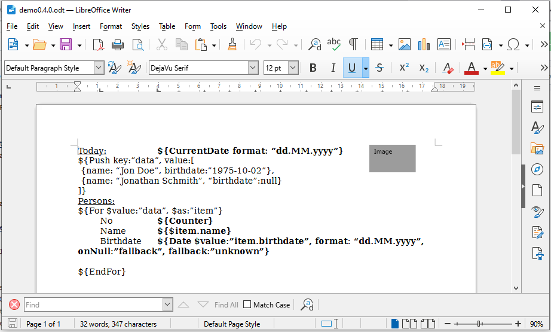
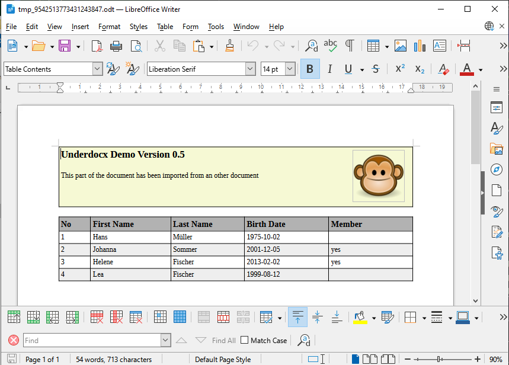
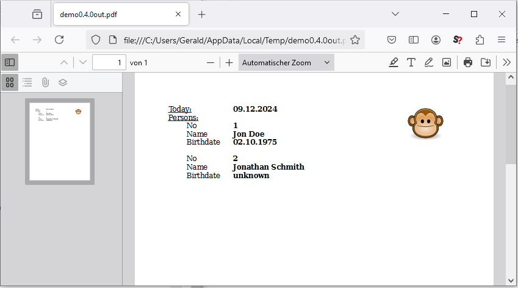

Underdocx is an extendable open source framework to manipulate ODT Documents
(LibreOffice / OpenOffice). It uses different types of placeholders that can be
found and replaced by custom texts, images, tables and other documents.
Also documents can be converted to PDF if LibreOffice has been installed.

Underdocx is still under development. See the
[Release-Plan](https://github.com/winterrifier/underdocx/wiki/Release-Plan)
which features are already available and will be released in the future.

## Demo

Here is a example to load and manipulate a LibreOffice document with multiple placeholders.
Some of these placeholders stand for simple texts, other represent an other
document that shall be imported. Images can also represent placeholders that shall be exchanged:



This code snipped reads the template document above and replaces the placeholders with data

```java
// Prepare document and engine
OdtContainer doc = new OdtContainer(is);
DefaultODTEngine engine = new DefaultODTEngine(doc);

// Alias placeholders
engine.registerStringReplacement("addHeaderAndFooter", "${Export $resource:\"master\"} ");
engine.registerStringReplacement("membersTable", "${Import $resource:\"membersTable\"} ");

// Variables / Data
engine.pushLeafVariable("membersTable", readResource("membertable.odt"));
engine.pushLeafVariable("master", readResource("master.odt"));
engine.pushLeafVariable("signatureImage", readResource("signature.png"));
engine.pushVariable("persons", createPersonsData());
engine.pushVariable("address", "Mr. Peter Silie\nKochstrasse 42\n38106 Braunschweig");
engine.pushVariable("contact", "Mr. Silie");
engine.pushVariable("signature", "Jon Sutton");

// Execute the engine
engine.run();
doc.save(os);
```
And you get a filled document like this one:



When LibreOffice is installed and LIBREOFFICE environment variable is set correctly you 
can also generate a PDF:

```java
doc.writePDF(pos);
```

